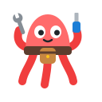

# Toolbelt for GitHub



A lightweight set of tweaks for GitHub's web interface. Each one turns a common multi-click chore into a single click.

## Features

### Hide as Outdated

Adds a button next to the `...` menu on each pull request comment. One click hides the comment as Outdated, replacing the usual five clicks (`...` → Hide → open the reason menu → Outdated → Hide comment).

Works on top-level comments and inline review comments in a pull request's Conversation tab.

## Installation

### From the Chrome Web Store

1. Open the [store page](https://chromewebstore.google.com/detail/<add-after-publishing>). The listing is unlisted, so only people with the link can find it.
2. Click **Add to Chrome**.

On Microsoft Edge, open the same link and click **Get**. The first time, Edge asks whether to allow extensions from other stores. Click **Allow**.

Store installs update automatically.

### From source

Use this to develop the extension or to try changes that haven't been published yet.

1. Clone this repository.
2. Open `chrome://extensions` (or `edge://extensions` on Edge) and turn on **Developer mode**.
3. Click **Load unpacked** and select the repository folder.
4. Reload any open GitHub pages.

After changing the code, click the extension's reload button on the extensions page, then reload the GitHub page.

## How it works

GitHub puts a hidden minimize form inside every comment. The button sets the form's reason to Outdated and submits it, and GitHub's own JavaScript collapses the comment.

- Uses your existing browser session, so no personal access token is needed.
- Runs only on `https://github.com/*` and requests no other permissions.
- Has no dependencies and no build step.

## Limitations

- The button appears only on comments you're allowed to hide (write access to the repository).
- Issues pages and the new Files changed page are built with React and don't include this form, so the button doesn't appear there.
- A GitHub redesign may make the button disappear. To fix it, start with `FORM_SELECTOR` and `MENU_SELECTOR` at the top of `content.js`.

## Publishing a new version

1. Bump `version` in `manifest.json`.
2. Package the extension:

   ```sh
   zip -X toolbelt-for-github.zip manifest.json content.js icons/*.png LICENSE THIRD_PARTY_NOTICES.md
   ```

3. Upload the zip in the [Chrome Web Store Developer Dashboard](https://chrome.google.com/webstore/devconsole) and submit it for review.

Every update goes through review. Most reviews finish within a few days, but some take a few weeks.

The icon sources in `icons/` aren't packaged: `icon.svg` for 48 and 128 px, `icon-small.svg` for 32 px, and the pixel-art `icon16.svg` for 16 px.

## Privacy

Toolbelt for GitHub doesn't collect, store, or transmit any data. See [PRIVACY.md](PRIVACY.md).

## License

[MIT](LICENSE). The button icon comes from [Primer Octicons](https://github.com/primer/octicons) (MIT). See [THIRD_PARTY_NOTICES.md](THIRD_PARTY_NOTICES.md).

Not affiliated with or endorsed by GitHub.
